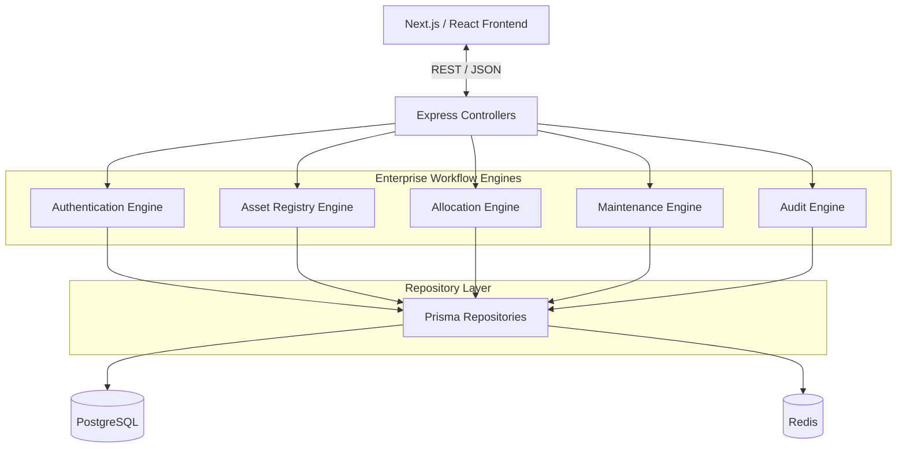

<div align="center">
  

  <h1>AssetFlow</h1>
  <p><strong>The Enterprise-Grade Asset & Resource Management Operating System</strong></p>

  <p>
    
    
    
    
  </p>
</div>

<br />

> **AssetFlow is built for the Odoo Hackathon 2026**. It is a robust, production-quality Enterprise Resource Planning (ERP) module designed to enable organizations to efficiently manage physical assets, shared resources, allocations, transfers, bookings, maintenance, audits, and role-based workflows with complete traceability and data integrity.

---

## ⚡ Why AssetFlow?

Most asset management systems are just glorified CRUD apps. AssetFlow is an **Enterprise Workflow Platform**. We focus on correctness, scale, and uncompromising security.

- **Unbreakable State Machine**: Business rules are enforced by PostgreSQL and a robust service layer, preventing invalid states.
- **Role-Based Workflows**: Granular RBAC ensures that only authorized personnel can approve transfers, request maintenance, or view audits.
- **Modular Monolith Architecture**: The codebase is cleanly separated by domain, providing the maintainability of microservices without the operational overhead.
- **Premium User Experience**: A blazingly fast, highly-polished React frontend matching top-tier SaaS applications like Linear, Vercel, and Stripe.

---

## 🏗️ Architecture

AssetFlow follows a strict **Modular Monolith** architecture. The application is logically partitioned by business domains while maintaining a single, highly-performant deployment artifact.



### Core Engineering Principles
1. **Single Responsibility**: Every module, class, and function has one clear responsibility.
2. **Explicit Business Rules**: Logic is encapsulated completely within the Service layer. Controllers are purely for parsing requests.
3. **Database Integrity**: The application leverages native PostgreSQL constraints (Foreign Keys, Partial Indexes, Exclusion Constraints) as the ultimate source of truth.
4. **Security First**: Every endpoint authenticates, authorizes (RBAC), validates via Zod, and audits.

---

## 🛠️ Technology Stack

AssetFlow leverages modern tooling designed for scale, type safety, and developer velocity.

### 🎨 Frontend
- **React Ecosystem**: Next.js & React 18 for high-performance rendering.
- **TypeScript**: End-to-end type safety.
- **Tailwind CSS**: Utility-first CSS for rapid, scalable styling.
- **shadcn/ui**: Accessible, customizable unstyled components.
- **TanStack Query**: Powerful asynchronous state management and caching.
- **React Hook Form + Zod**: Complex form state management with strict runtime validation.

### ⚙️ Backend
- **Node.js + Express.js**: High-performance asynchronous API server.
- **TypeScript**: Strict compilation for the entire backend domain.
- **Prisma ORM**: Next-generation Node.js and TypeScript ORM.
- **JWT & RBAC**: Secure stateless authentication and Role-Based Access Control.

### 🗄️ Infrastructure
- **PostgreSQL**: Primary transactional database.
- **Redis**: Caching and session management.
- **Docker**: Containerized environments for reproducible builds.

---

## 🧩 Core Modules

AssetFlow is composed of the following business modules, powered by shared engineering engines:

### 1. Authentication & Security
Secure login, JWT rotation, and hierarchical Role-Based Access Control (Admin, Manager, Employee, Auditor).

### 2. Master Data & Organization
Manage departments, physical locations, user hierarchies, and master asset catalogs.

### 3. Asset Registry
The single source of truth for the physical lifecycle of an asset—from procurement to depreciation and retirement.

### 4. Allocation & Transfer
Complex state machines governing the assignment of assets to employees, including multi-stage approval flows for cross-department transfers.

### 5. Resource Booking
Real-time scheduling and conflict prevention for shared resources (e.g., conference rooms, vehicles).

### 6. Maintenance & Servicing
Tracking asset repairs, proactive maintenance schedules, and condition states over time.

### 7. Compliance & Audit
System-wide, immutable logging of every transactional event, plus orchestrated physical asset verification cycles.

### 8. Analytics Engine
High-level operational dashboards, usage metrics, and resource optimization reporting.

---

## 🚀 Getting Started

To get AssetFlow running locally, follow these instructions:

### Prerequisites
- Node.js (v20+)
- PostgreSQL (v15+)
- Docker & Docker Compose (optional, for Redis)
- npm or pnpm

### 1. Clone the Repository
```bash
git clone https://github.com/your-org/odoo-hackathon-2026.git
cd odoo-hackathon-2026
```

### 2. Setup the Backend
```bash
cd backend
npm install

# Configure environment variables
cp .env.example .env

# Push the schema to your PostgreSQL database
npx prisma db push

# (Optional) Seed the database with mock data
npm run seed

# Start the development server
npm run dev
```

### 3. Setup the Frontend
```bash
cd ../frontend
npm install

# Configure environment variables
cp .env.example .env

# Start the Vite/Next.js dev server
npm run dev
```

You can now access the application at `http://localhost:5173`.

---

## 🔐 Security & Data Philosophy

1. **AI is an Enhancement, not a Core Dependency**: AssetFlow works 100% perfectly without AI. The AI Copilot simply orchestrates existing business services and never bypasses RBAC.
2. **PostgreSQL is the Source of Truth**: The database prevents invalid states, not just the application layer. Data anomalies are physically impossible at the persistence layer.
3. **Frontend is Strictly Presentation**: The frontend forms, tables, and dashboards never implement business rules. They only reflect the server's state.
4. **Immutable Audits**: System activity logs cannot be mutated or deleted by any user, including administrators.

---

## 🗺️ Development Roadmap

Development is structured into strict phases, ensuring the backend foundation is rock solid before UI implementation:

- [x] **Phase 0**: Engineering Foundation
- [x] **Phase 1**: Infrastructure
- [x] **Phase 2**: Core Framework
- [x] **Phase 3**: Authentication & RBAC
- [x] **Phase 4**: Master Data Engine
- [ ] **Phase 5**: Asset Registry
- [ ] **Phase 6**: Workflow Engine
- [ ] **Phase 7**: Booking Engine
- [ ] **Phase 8**: Maintenance Engine
- [ ] **Phase 9**: Audit Engine
- [ ] **Phase 10**: Dashboard & Realtime
- [ ] **Phase 11**: Deployment & Hardening

---

## 🤝 Contributing

This project is currently under active development for the Odoo Hackathon 2026. If you're a team member looking to contribute, please ensure you read `docs/01_CONTEXT.md` and `docs/07_SECURITY_AND_ENGINEERING_RULES.md` before writing any code.

**All PRs require:**
1. 100% TypeScript compilation success.
2. No direct Prisma calls in Controllers.
3. Adherence to the defined State Machine.

---

<div align="center">
  <p>Built with 🩵 by the AssetFlow Team</p>
</div>
